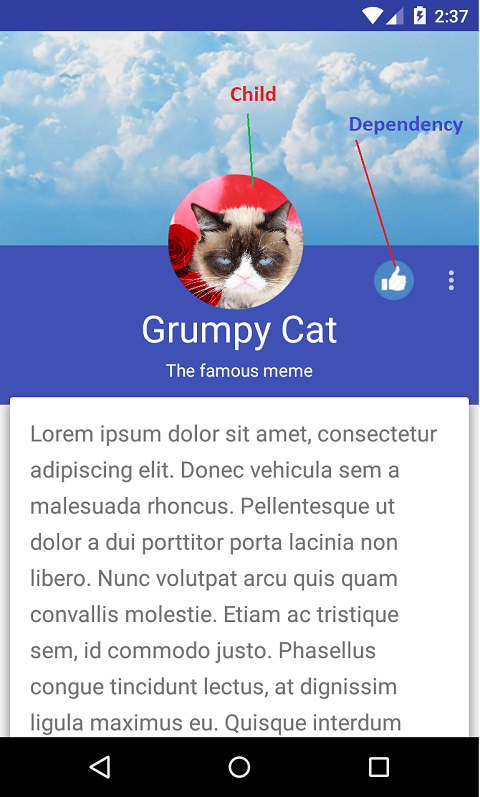

# 1、photoviewdemo 
PhotoView 图片浏览缩放控件,点击进入：[PhotoView开源项目](https://github.com/bm-x/PhotoView)

# 效果图


# 使用
1、Gradle添加依赖 (推荐；或者也可以将项目下载下来，将Info.java和PhotoView.java两个文件拷贝到你的项目中，不推荐)
```java
dependencies {
    compile 'com.bm.photoview:library:1.4.0'
}
```

2、添加XML文件
```java
<com.bm.library.PhotoView
     android:id="@+id/img"
     android:layout_width="match_parent"
     android:layout_height="match_parent"
     android:scaleType="centerInside"
     android:src="@drawable/bitmap1" />
```

3、java代码调用
```java
        PhotoView photoView = (PhotoView) findViewById(R.id.img);
        // 启用图片缩放功能
        photoView.enable();
        // 禁用图片缩放功能 (默认为禁用，会跟普通的ImageView一样，缩放功能需手动调用enable()启用)
        photoView.disenable();
        // 获取图片信息
        Info info = photoView.getInfo();
        // 从普通的ImageView中获取Info
        Info info = PhotoView.getImageViewInfo(ImageView);
        // 从一张图片信息变化到现在的图片，用于图片点击后放大浏览，具体使用可以参照demo的使用
        photoView.animaFrom(info);
        // 从现在的图片变化到所给定的图片信息，用于图片放大后点击缩小到原来的位置，具体使用可以参照demo的使用
        photoView.animaTo(info,new Runnable() {
               @Override
               public void run() {
                   //动画完成监听
               }
           });
        // 获取/设置 动画持续时间
        photoView.setAnimaDuring(int during);
        int d = photoView.getAnimaDuring();
        // 获取/设置 最大缩放倍数
        photoView.setMaxScale(float maxScale);
        float maxScale = photoView.getMaxScale();
        // 设置动画的插入器
        photoView.setInterpolator(Interpolator interpolator);
```

# Custom-Coordinator-Behavior :自定义CoordinatorLayout Behavior

#依赖关系图


#效果图


# DemoActivity


# ProfileActivity


# 无限循环的广告Banner图实现,真正做到的无限循环

#效果图

1、代码实现
a、xml定义：
```java
    <RelativeLayout
        android:layout_width="match_parent"
        android:layout_height="wrap_content" >

        <com.org.lengend.pagedview.PagedView
            android:id="@+id/cyclePagedView"
            android:layout_width="match_parent"
            android:layout_height="wrap_content" />

        <com.org.lengend.pagedview.PageIndicatorView
            android:id="@+id/pageIndicatorView"
            android:layout_width="match_parent"
            android:layout_height="40dp"
            android:layout_alignBottom="@+id/cyclePagedView"
            android:layout_alignParentLeft="true"
            android:layout_alignParentStart="true" />
    </RelativeLayout>
```
b、activity实现：
```java
List<String> urls = new ArrayList<String>();
urls.add("http://img4.imgtn.bdimg.com/it/u=1238985129,963468829&fm=21&gp=0.jpg");
urls.add("http://img3.imgtn.bdimg.com/it/u=4258063781,3013778552&fm=21&gp=0.jpg");
urls.add("http://img0.imgtn.bdimg.com/it/u=2231837044,3643597260&fm=21&gp=0.jpg");
urls.add("http://pic0.mofang.com/2014/1113/20141113110312116.jpg");
PagedView cyclePagedView = (PagedView) findViewById(R.id.cyclePagedView);
MyPagedViewAdapter adapter = new MyPagedViewAdapter(this);
adapter.setImageUrls(urls);
PageIndicatorView pageIndicatorView = (PageIndicatorView) findViewById(R.id.pageIndicatorView);
cyclePagedView.setPageIndicator(pageIndicatorView);
//是否自动轮播
cyclePagedView.setAutoPage(true);
//设置自动轮播时间间隔
cyclePagedView.setStepPageTime(3000);
cyclePagedView.setAdapter(adapter);
//设置当前显示的索引，从0开始
cyclePagedView.setCurrentIndex(5);
```
c、adapter实现：
```java
public class MyPagedViewAdapter extends PagedViewAdapter<MyPagedViewAdapter.PagedViewHolder> {

    private Context context;
    List<String> imageUrls;
    public MyPagedViewAdapter(Context context){
        this.context = context;
    }

    public void setImageUrls(List<String> imageUrls) {
        this.imageUrls = imageUrls;
    }

    @Override
    public int getCount() {
        return imageUrls == null ? 0 : imageUrls.size();
    }

    @Override
    public PagedViewHolder onCreateViewHolder(ViewGroup parent, int viewType) {
        View itemView = View.inflate(context, R.layout.image_view, null);
        PagedViewHolder holder = new PagedViewHolder(itemView);
        return holder;
    }

    @Override
    public void onBindViewHolder(PagedViewHolder holder, int position) {
        String url = imageUrls.get(position);
        Picasso.with(context).load(url).into(holder.imageView);
    }


    static class PagedViewHolder extends RecyclerView.ViewHolder{

        private ImageView imageView;
        public PagedViewHolder(View itemView) {
            super(itemView);
            imageView = (ImageView) itemView.findViewById(R.id.imageView);
        }
    }
}
```


# 手机无线连接Android Studio
[原文连接](http://blog.csdn.net/kv110/article/details/39438853)

1、查看手机IP : 192.168.x.x
2、PC端 ping 192.168.x.x 看能否ping的通
3、在PC端输入下面命令
    adb tcpip 5555
    adb connect 192.168.*.* (手机ip地址）
    (如果还连着USB, 输入其他命令时先输入adb devices， 输入adb -s device_name 命令)
    用下面的命令切回到usb方式
    adb usb
4、如果没有USB线，
    可以用手机端terminal工具输入，需要root权限
    su 
    setprop service.adb.tcp.port 5555  
    stop adbd   
    start adbd   
    在PC端，输入ping 手机的ip 地址，看看是否成功. 然后输入命令
    adb connect 192.168.x.x  (手机ip地址）
    断开 adb disconnect 192.168.x.x 

